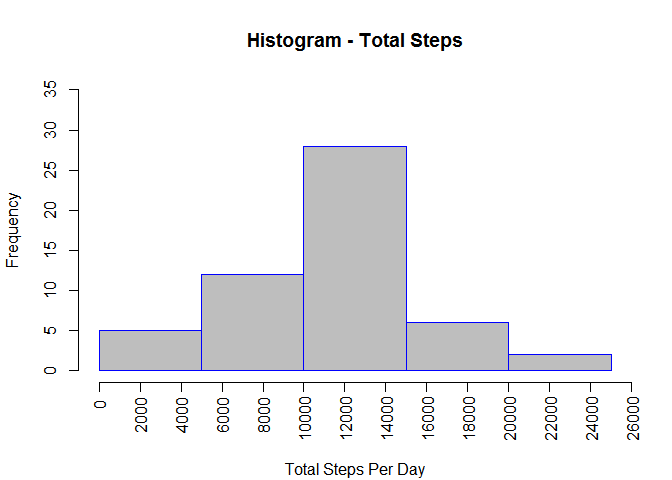
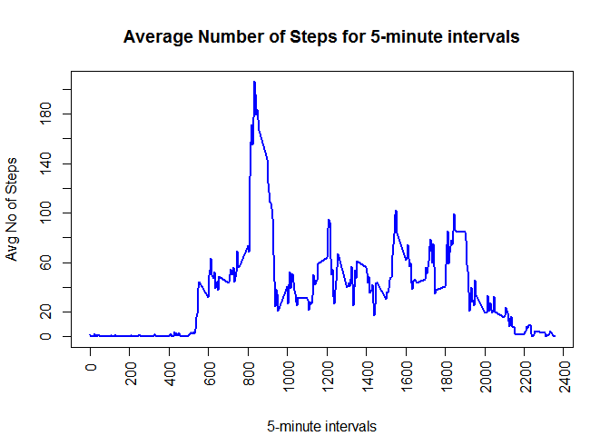
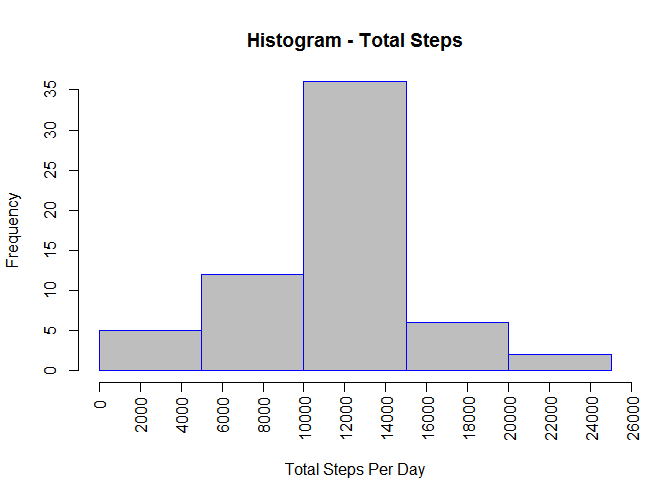
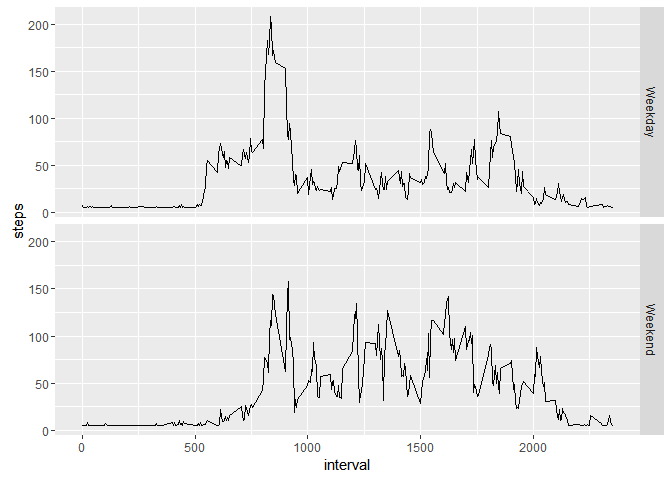

# Reproducible Research: Peer Assessment 1


## Loading and preprocessing the data

#### Extract the .CSV file from the .ZIP file, first checking if they don't exist already

```r
if(!file.exists("activity.csv"))
  unzip("activity.zip")
#read the .csv file and store the data in activity_data variable
if(!exists("activity_data"))
  activity_data <- read.csv("activity.csv")
```


## What is mean total number of steps taken per day?

#### Using <i>aggregate</i> function to calculate the total number of steps for each date

```r
Datewise_Total_Steps <- aggregate(steps~date, 
                                  activity_data, sum, 
                                  na.action = na.omit)
```

#### Now, here is the Histogram showing the total steps taken each day

```r
# for x-axis tick marks from 0 to 26000 at intervals of 2000
x_axis_ticks <- seq(from = 0, to = 26000, by = 2000)
hist(Datewise_Total_Steps$steps,
     main="Histogram - Total Steps", col="gray", border="blue",
     ylim = c(0,35), xaxt = "n", xlab="")
# create x-axis using x_axis_ticks for the tick marks, showing the labels vertically
axis(side=1, at=x_axis_ticks, las=2, hadj = 0.9)
# create the x-axis label
mtext(text="Total Steps Per Day", side=1, line=4)
```

<!-- -->

#### The mean and median of the total steps taken per day are, 

```r
Steps_mean <- mean(Datewise_Total_Steps$steps, na.rm = TRUE)
Steps_meadian <- median(Datewise_Total_Steps$steps, na.rm = TRUE)
print(paste("Mean Total Steps / Day   = ", round(Steps_mean) , sep=" "))
```

```
## [1] "Mean Total Steps / Day   =  10766"
```

```r
print(paste("Median Total Steps / Day = " , round(Steps_meadian), sep=" "))
```

```
## [1] "Median Total Steps / Day =  10765"
```


## What is the average daily activity pattern?

#### Calculate the average number of steps taken per 5-minute interval, where the steps taken are averaged across all days.

#### Using function <i>aggregate</i> to compute this average with <i>steps~interval</i> formula,

```r
Avg_Steps_Per_Interval <- aggregate(steps~interval, 
                                    activity_data, mean, 
                                    na.action = na.omit)
```

#### ...and here is the XY-plot showing average number of steps(y-axis) for each 5-minute interval(x-axis)..

```r
# x-axis tick marks from 0 to 2400 (higher than max 5-minuter interval value),
# with each interval of 200 points
x_axis_ticks <- seq(from = 0, to = 2400, by = 200)
# y-axis tick marks from 0 to 200 with tick-interval of 20
y_axis_ticks <- seq(from=0, to=200, by=20)

# plot the time series with the 5-minute interval on x-axis and
# average number of steps on y-axis
plot(Avg_Steps_Per_Interval$interval, # 5-minute interval on x-axis 
     Avg_Steps_Per_Interval$steps,    # Avg no of steps on y-axis
     type="l", xaxt="n", yaxt="n",    # type="l" for line graph
     xlab="", ylab="", col="blue", lwd=2,
     main="Average Number of Steps for 5-minute intervals")

# create x and y-axis labels using the variables we created
axis(side=1, at=x_axis_ticks, las=2, hadj = 0.9)
axis(side=2, at=y_axis_ticks)

# create the appropriate axis lables
mtext(text="5-minute intervals", side=1, line=4)
mtext(text="Avg No of Steps", side=2, line=3)
```

<!-- -->

#### In all days, which 5-minute interval has the highest average steps taken?

```r
max_avg_steps <- max(Avg_Steps_Per_Interval$steps)
interval_with_max_steps <- Avg_Steps_Per_Interval[
                            Avg_Steps_Per_Interval$steps == max_avg_steps,1]
print(paste("5-minute interval with max steps = ", interval_with_max_steps, sep=" "))
```

```
## [1] "5-minute interval with max steps =  835"
```


## Imputing missing values

#### Note that there are a number of days/intervals where there are missing values (coded as NA).

#### Caculate and show the number of rows which have the <i>stepts</is> data as NA.

```r
missing_values <- is.na(activity_data$steps)
table(missing_values)
```

```
## missing_values
## FALSE  TRUE 
## 15264  2304
```

#### We will replace the NA values in the </i>steps</i> column with the average value of steps taken, 

```r
# find the mean of steps column for all rows, round it off
mean_steps <- round(mean(activity_data$steps, na.rm=TRUE))

# keep the original data in another variable
activity_data_original <- activity_data
# replace all instances of NA in the "steps" column with this 
# average steps value
activity_data[["steps"]][is.na(activity_data[["steps"]])] <- mean_steps
```

#### Now, after "imputing the missing values", we will recalculate the steps taken for each date,

```r
Datewise_Total_Steps <- aggregate(steps~date, 
                                  activity_data, sum, 
                                  na.action = na.omit)
```

#### ...and here is the new histogram after imputing the missing values...

```r
# for x-axis tick marks from 0 to 26000 at intervals of 2000
x_axis_ticks <- seq(from = 0, to = 26000, by = 2000)
hist(Datewise_Total_Steps$steps,
     main="Histogram - Total Steps", col="gray", border="blue",
     ylim = c(0,35), xaxt = "n", xlab="")
# create x-axis using x_axis_ticks for the tick marks, showing the labels vertically
axis(side=1, at=x_axis_ticks, las=2, hadj = 0.9)
# create the x-axis label
mtext(text="Total Steps Per Day", side=1, line=4)
```

<!-- -->

#### The new mean and median of the total steps taken are,

```r
Steps_mean <- mean(Datewise_Total_Steps$steps, na.rm = TRUE)
Steps_meadian <- median(Datewise_Total_Steps$steps, na.rm = TRUE)
print(paste("Mean Total Steps / Day   = ", round(Steps_mean) , sep=" "))
```

```
## [1] "Mean Total Steps / Day   =  10752"
```

```r
print(paste("Median Total Steps / Day = " , round(Steps_meadian), sep=" "))
```

```
## [1] "Median Total Steps / Day =  10656"
```

#### We can observe the differences in the original and new values after replacing the missing values.


## Are there differences in activity patterns between weekdays and weekends?

#### Here, we will compare the data in two sets - Weekends(Saturday, Sunday) and Weekdays (Monday, Tuesday, Wednesday, Thursday, Friday)

```r
weekday_or_weekend <- function(date) {
  if(weekdays(date)=="Sunday" || weekdays(date)=="Saturday")
    "Weekend"
  else
    "Weekday"
}
```

#### We will add a new column named <i>WeekDay_Weekend</i> to the dataset, which will have this infromation computed using the <i>weekdays</i> function,

```r
date_data <- as.Date(activity_data$date)
Weekday_Weekend <- sapply(date_data, FUN=weekday_or_weekend)
# add this new data as a column into the activity_data using cbind function
activity_data <- cbind(activity_data, Weekday_Weekend)
```

#### Now, here is the XY-Plot for Weekdays and Weekends, plotted using ggplot with the <i>facet_grid</i> feature

```r
# find the average steps taken per 5-minute interval for weekdays and weekends
avg_weekday_weekend <- aggregate(steps~interval + Weekday_Weekend,
                                 activity_data, mean)
# load the ggplot2 library
library(ggplot2, warn.conflicts = FALSE, quietly = TRUE)
```

```
## Warning: package 'ggplot2' was built under R version 3.2.5
```

```r
# initiate the ggplot with interval on x-axis and steps on y-axis
gg <- ggplot(avg_weekday_weekend, aes(interval, steps))
gg <- gg + geom_line()
# use the facet_grid feature with the two factors - Weekday and Weekend
gg <- gg + facet_grid(Weekday_Weekend~.)
# print the graph
print(gg)
```

<!-- -->

#### We can easily observe from these 2 plots that the average number of steps are higher on Weekdays than on the Weekends.

#### ******************* END OF REPORT *******************
